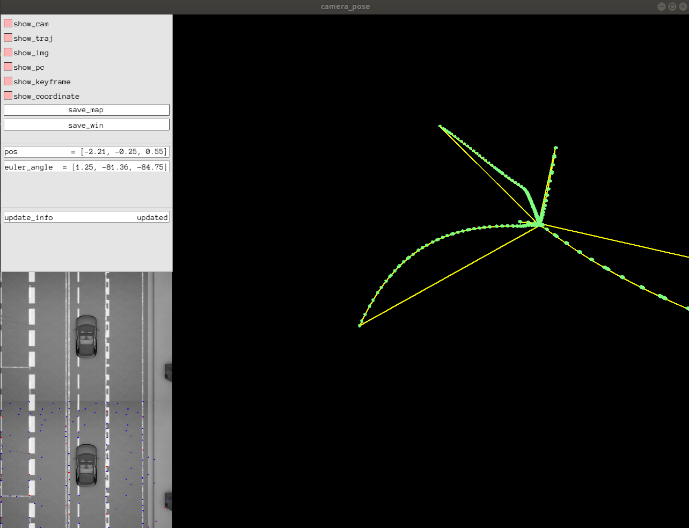
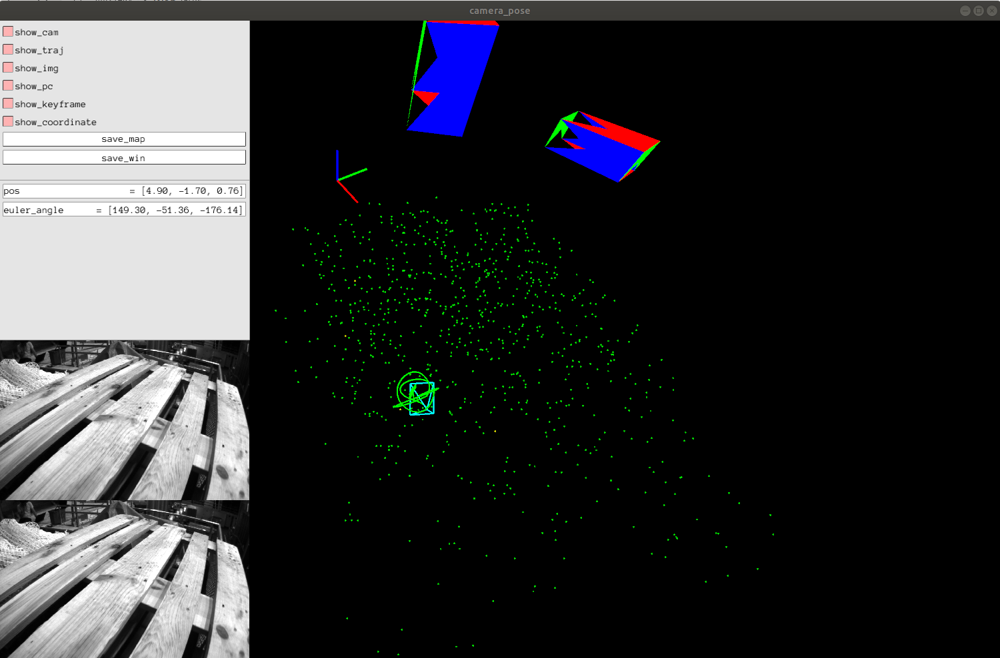

# Pangolin-Viewer
simple pangolin viewer

## ToDo List

- [x] add pointcloud view
- [x] add keyframe and trajectory
- [ ] fix box bugs

## Images

  
  

## Reference
* [pangolin_tutorial](https://github.com/yuntianli91/pangolin_tutorial.git)
